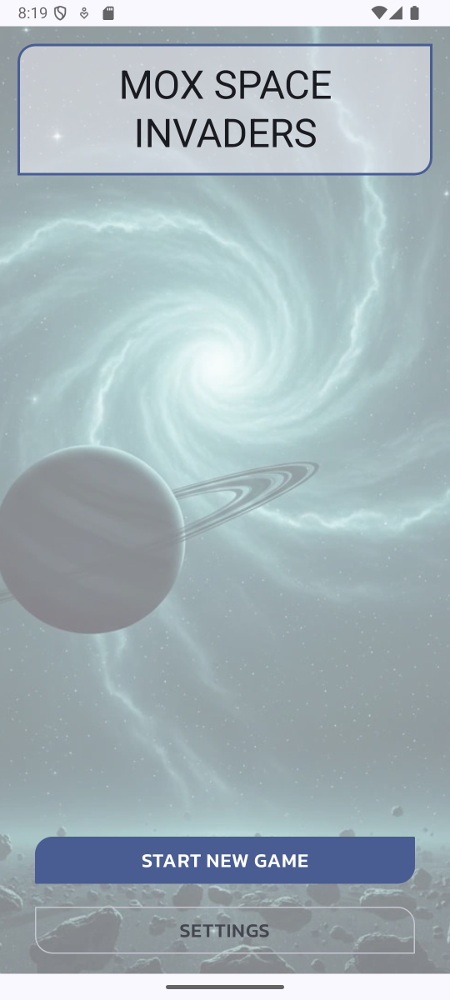
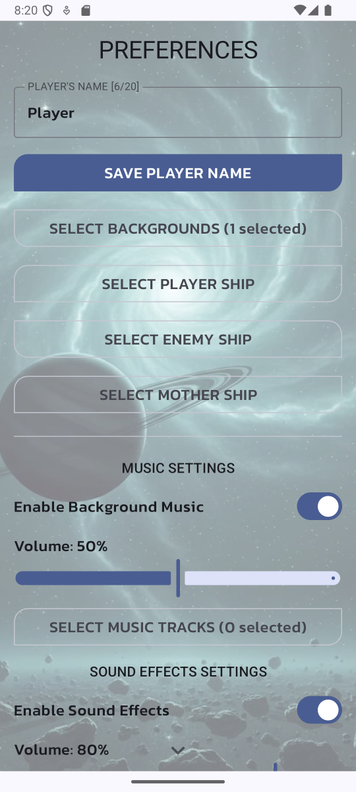
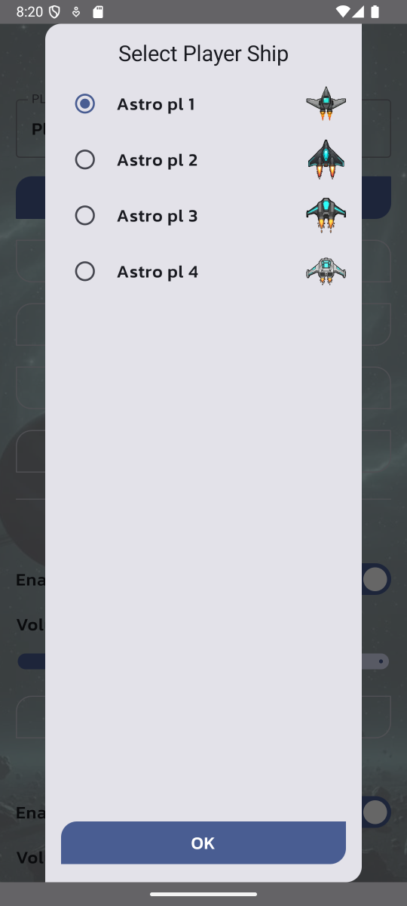
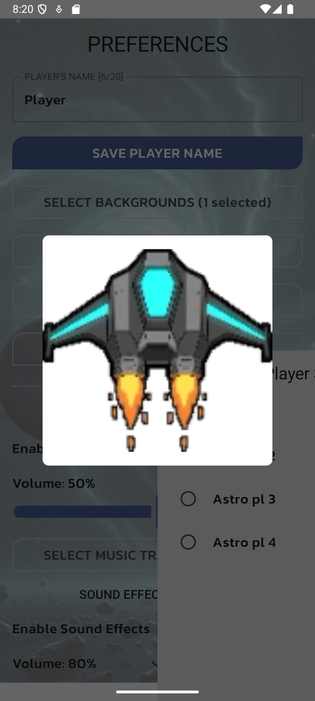
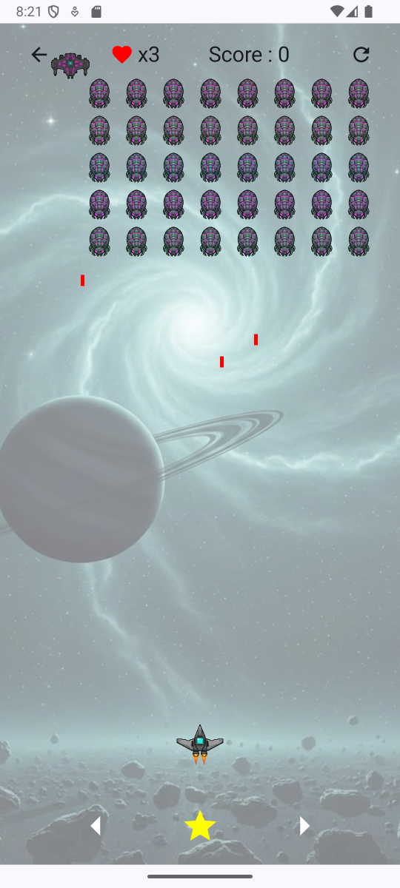
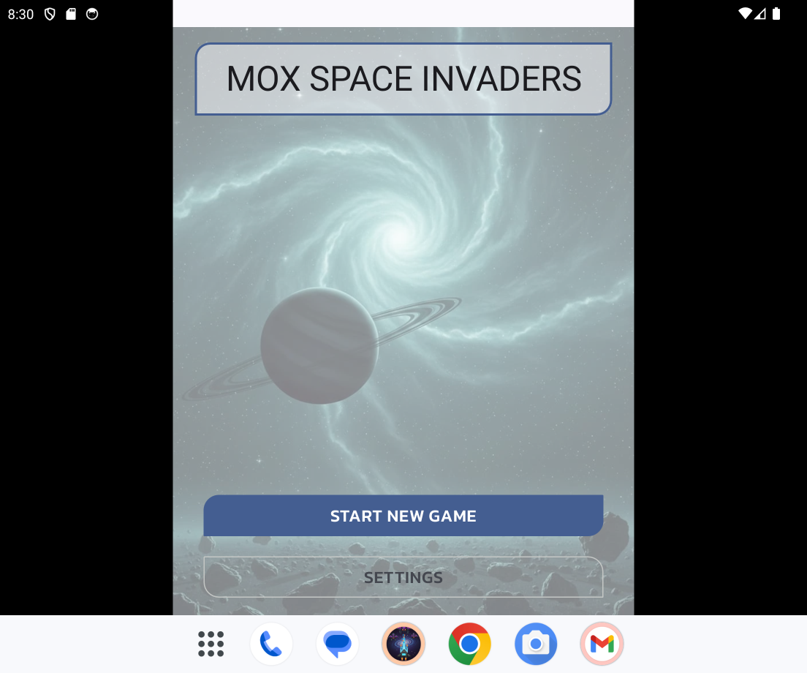
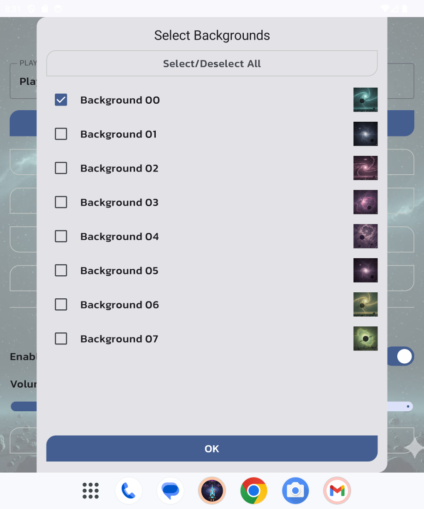
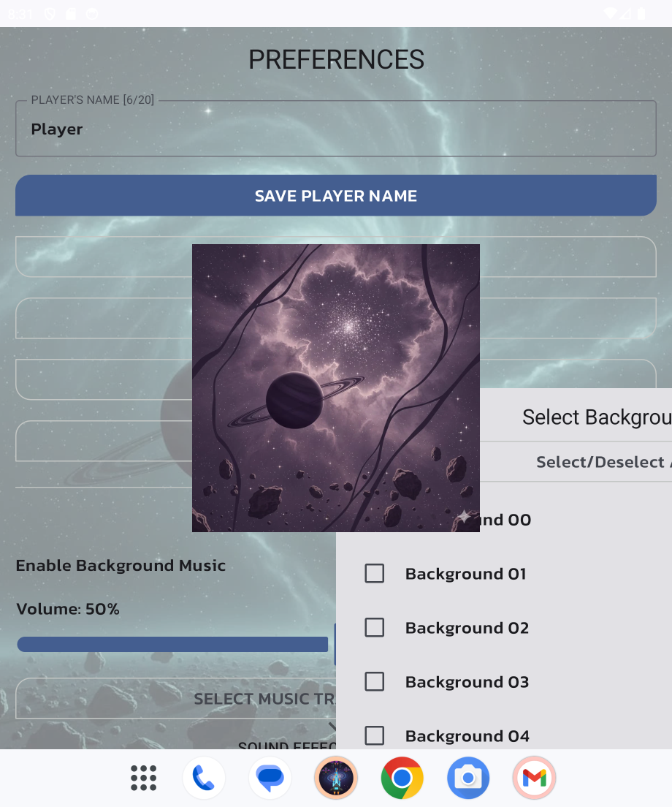
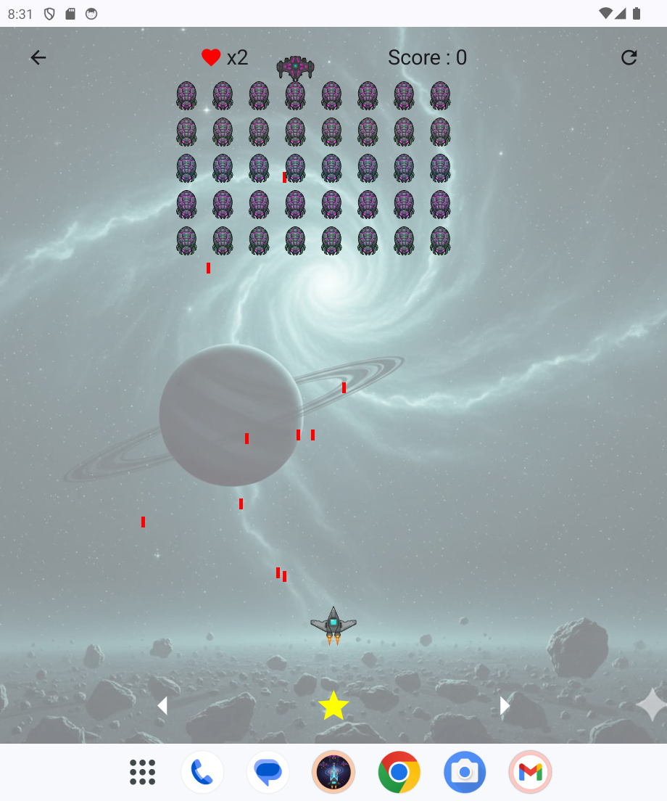

# Mox Space Invaders

A modern implementation of a classic Space Invaders for Android, built entirely with Jetpack Compose.
Based on the skeleton of "Mox Memory Game" app.

## Screenshots

  
  
  

## Tech Stack & Key Features

This project showcases a variety of modern Android development practices.

*   **UI:** Built entirely with [Jetpack Compose](https://developer.android.com/jetpack/compose), Android's modern toolkit for building native UI.
*   **Architecture:** Follows a clean MVVM (Model-View-ViewModel) architecture.
*   **Dependency Injection:** Centralized and decoupled dependency management using [Koin](https://insert-koin.io/).
*   **Asynchronous Operations:** Leverages [Kotlin Coroutines](https://kotlinlang.org/docs/coroutines-overview.html) for background tasks and data management.
*   **Data Persistence:** User preferences and high scores are saved locally using [Jetpack DataStore](https://developer.android.com/topic/libraries/data-storage/datastore).
*   **Comprehensive Testing:**
    *   **Unit Testing:** Local unit tests for business logic with [JUnit 4](https://junit.org/junit4/) and [Robolectric](http://robolectric.org/).
    *   **UI Testing:** Instrumented tests for the user interface using the [Jetpack Compose testing framework](https://developer.android.com/jetpack/compose/testing).

## Core Functionalities

*   Classic Space Invaders game mechanics.
*   Customizable game mechanics.
*   High score ranking.
*   Extensive customization options:
    *   Multiple sets.
    *   Dynamic background selection.
    *   Full control over music and sound effects.

## How to Build and Test

### Prerequisites
*   Android Studio Iguana | 2023.2.1 or newer
*   JDK 17

### Running the Tests
The project is configured with two main Gradle tasks to run the complete test suite:

**Local Unit Tests:**
```bash
./gradlew unitTests
```

**UI (Instrumented) Tests:**
```bash
./gradlew instrumentationTests
```
